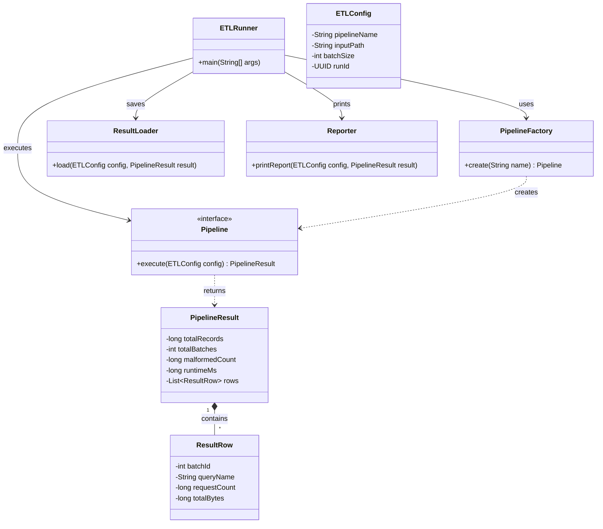
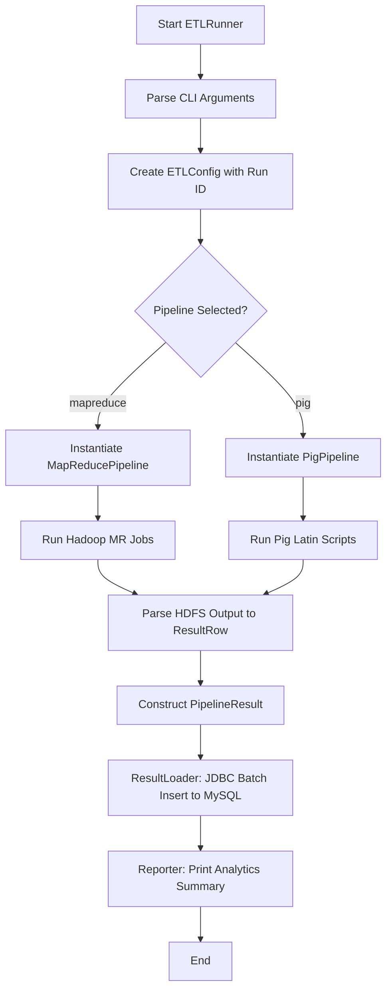
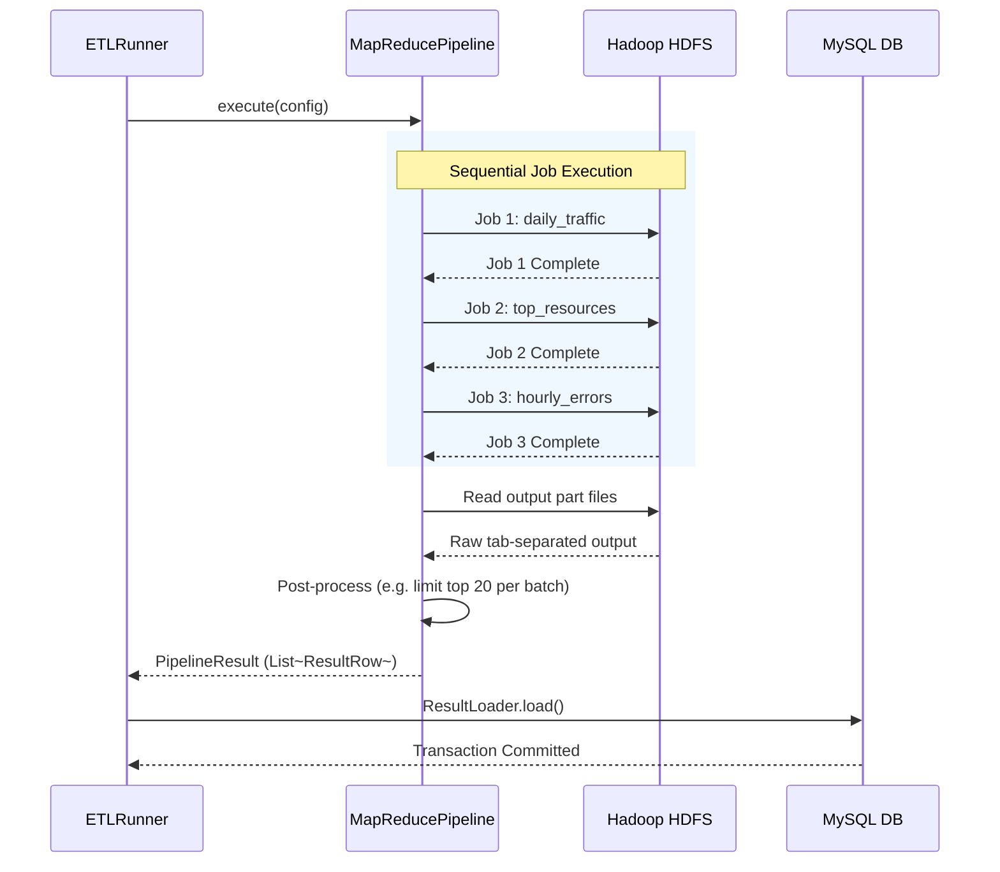

# NASA Log ETL Framework

A multi-pipeline ETL and reporting framework for NASA HTTP web server log analytics. This project supports pluggable pipelines (MapReduce and Pig implementations provided) to parse, aggregate, and store insights from web server logs into a relational database.

## Architecture & Flow

### Class Architecture

The framework relies on a core set of interfaces and models to abstract the execution details from the orchestrator (`ETLRunner`).



### Execution Flow (Activity Diagram)

The following activity diagram illustrates the overall lifecycle of a single ETL run:



### MapReduce Pipeline Sequence

A closer look at how the MapReduce pipeline specifically handles the distributed execution:



## Build
```bash
mvn clean package
```

## Setup
1. Copy `config/db.properties.example` to `config/db.properties` and edit the credentials.
2. Initialize MySQL tables: 
   ```bash
   mysql -u etl -p etldb < sql/schema.sql
   ```
3. Setup HDFS and upload data: 
   ```bash
   ./scripts/setup_hdfs.sh
   # Follow the printed instructions to upload your logs
   ```

## Run
Use the `run.sh` script to execute the pipeline. The wrapper automatically injects the compiled JAR and database credentials.

```bash
./scripts/run.sh --pipeline mapreduce --input /nasa/logs --batch-size 1000
```
*You can swap `--pipeline mapreduce` with `--pipeline pig`.*

## Dataset notes:
- July file covers Jul 01–31 1995 (3,461,612 requests total across both files)
- August file covers Aug 04–31 1995 — NOT Aug 01–31.
  The web server was shut down Aug 01 14:52:01 to Aug 03 04:36:13 due to Hurricane Erin.
  Expect no records in this range; this is not a parsing error.
- Timestamp format is non-standard: `[DAY MON DD HH:MM:SS YYYY]`
  Example: `[Thu Jul 01 00:00:08 1995]`
