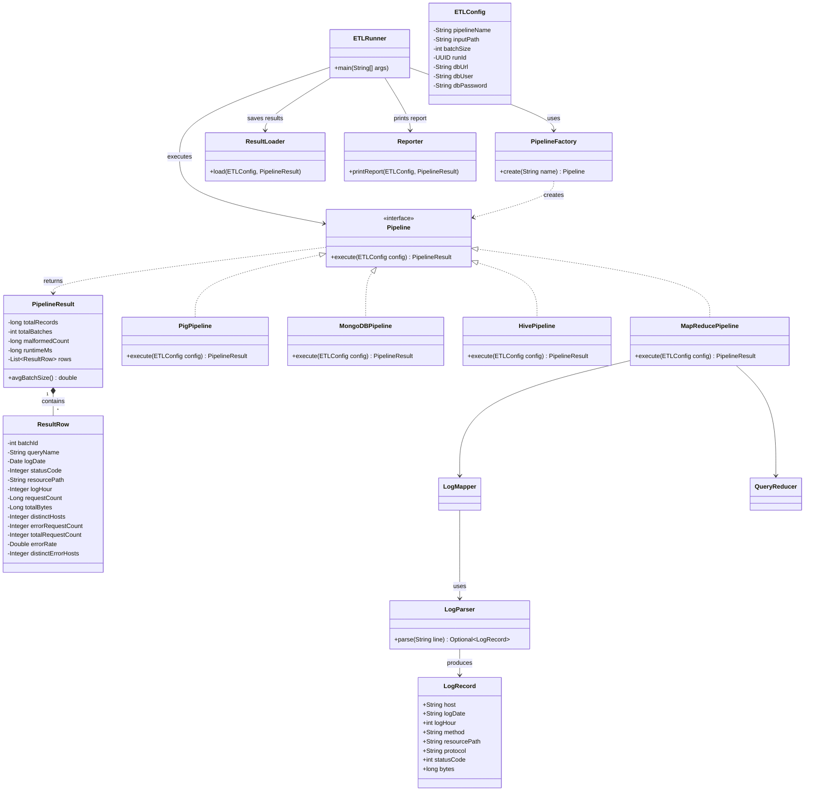
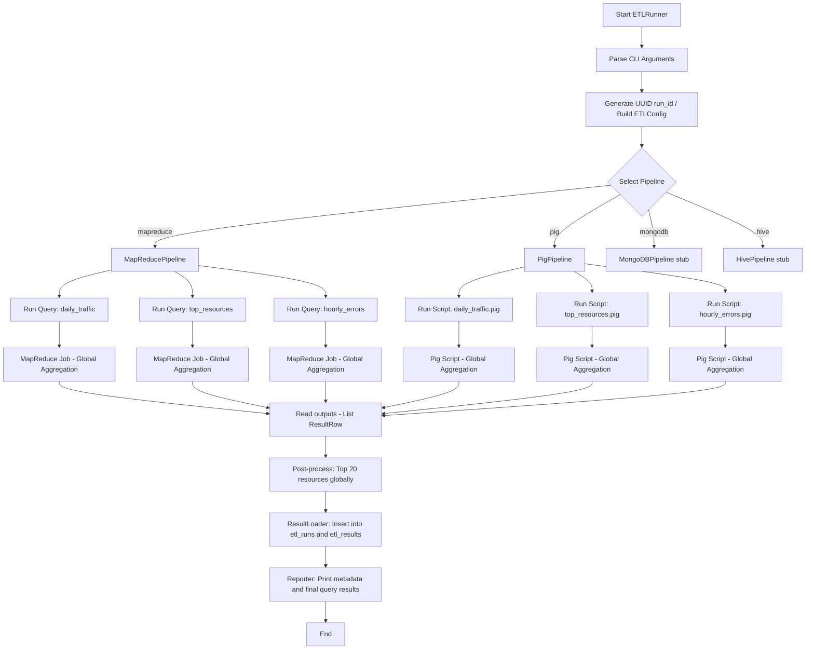
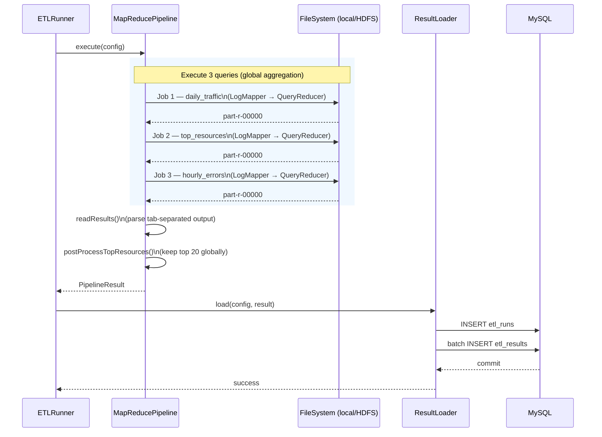
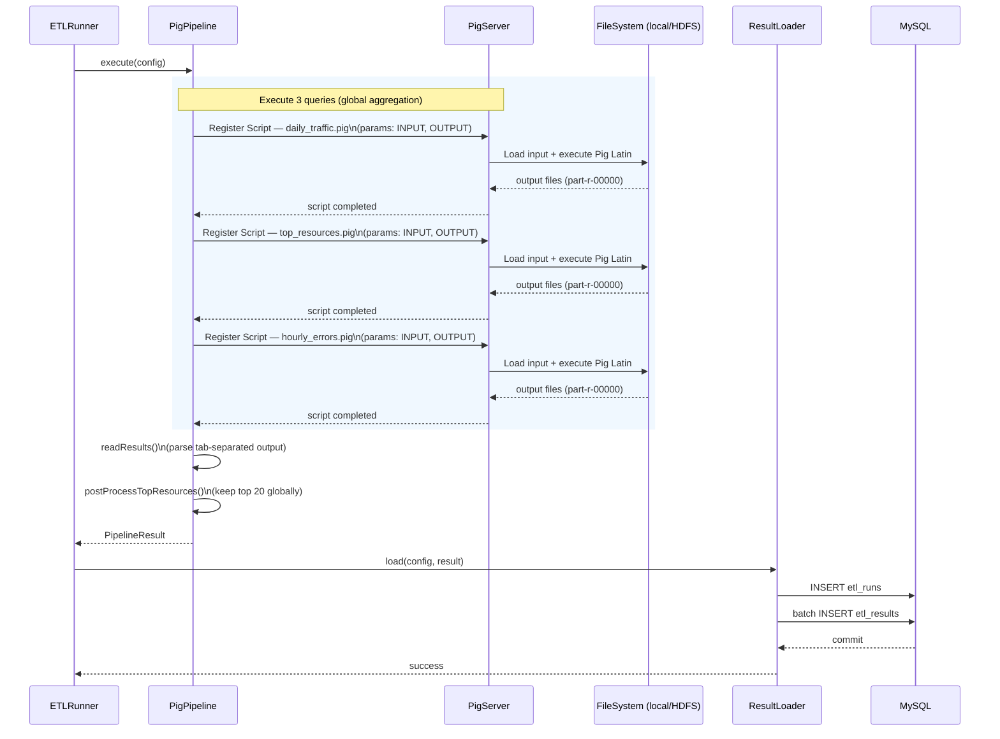

# NASA Log ETL Framework

A multi-pipeline ETL and reporting framework for NASA HTTP web server log analytics. The framework supports four pluggable execution backends — **MapReduce**, **Apache Pig**, **MongoDB**, and **Apache Hive** — that parse, aggregate, and store insights from raw web server logs into a relational MySQL database.

The user picks the execution backend, the query (`q1`, `q2`, `q3`, or `all`), and the batch size at the CLI. The ETL logic, parsing rules, batching logic, and reporting layer are identical across all four pipelines so the comparison is fair.

**Batching model.** Every pipeline produces *per-batch* aggregates: the raw input is split into batches of `batchSize` log lines, each batch is aggregated independently in the backend's own engine, and one result row is emitted per `(batch_id, group-by key)`. The reporter then computes a rolled-up global view in SQL on top of the per-batch rows.

---

## Architecture

The framework has three layers: a **controller layer** that owns the CLI, run ID, and lifecycle; an **execution layer** where four `Pipeline` implementations sit behind one interface; and an **output layer** where a shared `ResultLoader` and `Reporter` handle MySQL writes and console output identically for every pipeline.

### Class Architecture



### Execution Flow



### MapReduce Pipeline — Sequence


### Pig Pipeline — Sequence



---

## Dataset

| File | Period | Compressed | Uncompressed | Records |
|---|---|---|---|---|
| `NASA_access_log_Jul95` | Jul 01–31, 1995 | 20.7 MB | 205 MB | ~1,891,715 |
| `NASA_access_log_Aug95` | Aug 04–31, 1995 | 21.8 MB | 168 MB | ~1,569,898 |

**Log format** — each line is standard NCSA Combined Log:
```
199.72.81.55 - - [01/Jul/1995:00:00:01 -0400] "GET /history/apollo/ HTTP/1.0" 200 6245
```

**Important notes:**
- The August file covers **Aug 04–31 only**. The web server was shut down Aug 01 14:52:01 – Aug 03 04:36:13 due to Hurricane Erin. No records in this window is expected behaviour, not a parsing error.
- Download the files from the [Internet Traffic Archive](https://ita.ee.lbl.gov/html/contrib/NASA-HTTP.html). Decompression is the only allowed preprocessing.

---

## Prerequisites

- Java 8+
- Maven 3.6+
- Hadoop 3.3.6 (local mode works — no HDFS cluster required for development)
- MySQL 8+ with a database named `etldb`
- **MongoDB 5+** (only required for the MongoDB pipeline) — listening on `mongodb://localhost:27017` by default
- **HiveServer2** running and reachable at `jdbc:hive2://localhost:10000/default` (only required for the Hive pipeline)

---

## Build

```bash
mvn clean package
```

Produces `target/etl-framework-1.0.jar` (fat jar, all dependencies included).

---

## Setup

**1. Database credentials**

```bash
cp config/db.properties.example config/db.properties
# Edit config/db.properties with your MySQL host, user, and password
```

**2. Create MySQL tables**

```bash
mysql -u <user> -p etldb < sql/schema.sql
```

**3. Prepare input data**

```bash
gunzip NASA_access_log_Jul95.gz
gunzip NASA_access_log_Aug95.gz
```

For local mode the files can stay on the local filesystem. For cluster mode, upload to HDFS:

```bash
hdfs dfs -mkdir -p /nasa/logs
hdfs dfs -put NASA_access_log_Jul95 /nasa/logs/
hdfs dfs -put NASA_access_log_Aug95 /nasa/logs/
```

---

## Run

Use `scripts/run.sh` which injects the JAR path and DB credentials from `config/db.properties` automatically:

```bash
# MapReduce — local filesystem
./scripts/run.sh \
  --pipeline mapreduce \
  --input file:///path/to/NASA_access_log_Jul95 \
  --batch-size 50000

# Pig — local filesystem
./scripts/run.sh \
  --pipeline pig \
  --input file:///path/to/NASA_access_log_Jul95 \
  --batch-size 50000

# MapReduce — HDFS (cluster mode)
./scripts/run.sh \
  --pipeline mapreduce \
  --input hdfs:///nasa/logs/ \
  --batch-size 50000
```

Or invoke the JAR directly:

```bash
hadoop jar target/etl-framework-1.0.jar com.etl.ETLRunner \
  --pipeline mapreduce \
  --input file:///path/to/NASA_access_log_Jul95 \
  --batch-size 50000 \
  --db-url jdbc:mysql://localhost:3306/etldb \
  --db-user etl \
  --db-pass Etl@12345
```

**CLI flags:**

| Flag | Required | Default | Description |
|---|---|---|---|
| `--pipeline` | yes | — | `mapreduce`, `pig`, `mongodb`, `hive` |
| `--input` | yes | — | Input path (`file:///` or `hdfs:///`) |
| `--batch-size` | no | 50000 | Records per batch |
| `--query` | no | `all` | `q1` / `q2` / `q3` / `daily_traffic` / `top_resources` / `hourly_errors` / `all` |
| `--db-url` | yes | — | MySQL JDBC connection URL |
| `--db-user` | yes | — | MySQL username |
| `--db-pass` | yes | — | MySQL password |
| `--mongo-uri` | no | `mongodb://localhost:27017` | MongoDB connection string |
| `--mongo-db` | no | `etl_logs` | MongoDB database name to write the per-run collection into |
| `--hive-url` | no | `jdbc:hive2://localhost:10000/default` | HiveServer2 JDBC URL |
| `--hive-user` | no | empty | HiveServer2 username (if auth is enabled) |
| `--hive-pass` | no | empty | HiveServer2 password (if auth is enabled) |

If `--pipeline` is omitted in an interactive terminal, the CLI prompts the user to choose one of the four backends.

### Pipeline-specific examples

```bash
# MongoDB — runs the full ETL + aggregation against a local mongod
./scripts/run.sh \
  --pipeline mongodb \
  --input file:///path/to/NASA_access_log_Jul95 \
  --batch-size 50000

# Hive — runs HiveQL aggregations against a local HiveServer2
./scripts/run.sh \
  --pipeline hive \
  --input file:///path/to/NASA_access_log_Jul95 \
  --batch-size 50000 \
  --hive-url jdbc:hive2://localhost:10000/default

# Run only Query 2 (Top Resources) through MapReduce
./scripts/run.sh \
  --pipeline mapreduce \
  --input file:///path/to/NASA_access_log_Jul95 \
  --query q2
```

---

## Queries

All three queries are implemented identically across every pipeline. The same grouping keys, aggregation functions, and filter conditions are used in every execution backend.

| Query | Group By | Output Columns |
|---|---|---|
| Daily Traffic Summary | `log_date`, `status_code` | `request_count`, `total_bytes` |
| Top Requested Resources | `resource_path` | `request_count`, `total_bytes`, `distinct_host_count` — top 20 by request count |
| Hourly Error Analysis | `log_date`, `log_hour` | `error_request_count`, `total_request_count`, `error_rate`, `distinct_error_hosts` — status codes 400–599 |

---

## Database Schema

We use two tables in `etldb` to separate **execution metadata** from **query results**.

---

### **`etl_runs`** — one row per pipeline execution

Stores metadata about each ETL run.

| Column | Type | Description |
|---|---|---|
| `run_id` | VARCHAR(36) PK | UUID generated at startup |
| `pipeline` | VARCHAR(20) | Execution backend (mapreduce / pig / mongodb / hive) |
| `query_name` | VARCHAR(30) | Selected query: `daily_traffic` / `top_resources` / `hourly_errors` / `all` |
| `batch_size` | INT | Configured records per batch |
| `total_records` | BIGINT | Total records processed |
| `total_batches` | INT | Number of non-empty batches |
| `avg_batch_size` | DECIMAL(15,2) | `total_records / total_batches` |
| `malformed_count` | BIGINT | Records that failed parsing |
| `runtime_ms` | BIGINT | End-to-end runtime (read → compute → DB write) |
| `executed_at` | TIMESTAMP | Auto-generated timestamp of execution |

### **`etl_batches`** — one row per batch processed in a run

Captures per-batch metadata so the batching decisions are auditable.

| Column | Type | Description |
|---|---|---|
| `run_id` | VARCHAR(36) | FK to `etl_runs` |
| `batch_id` | INT | 1..N sequential batch identifier |
| `records_in_batch` | INT | Lines (records) belonging to this batch |
| `malformed_in_batch` | INT | Of those, lines that failed parsing |

---

### **`etl_results`** — query outputs (unified schema)

Stores results of all queries across all pipelines.

> One row represents a **(run × query × batch × group-by key)**. With per-batch aggregation, the same `log_date` / `resource_path` / `(log_date, log_hour)` can appear once per batch that contained it.

| Column | Type | Description |
|---|---|---|
| `id` | INT PK | Auto-increment row identifier |
| `run_id` | VARCHAR(36) FK | Links to `etl_runs` |
| `pipeline` | VARCHAR(20) | Redundant for faster filtering |
| `batch_id` | INT | Always `1` for global aggregation (legacy support for batching) |
| `query_name` | VARCHAR(30) | Query identifier (`daily_traffic`, `top_resources`, `hourly_errors`) |

#### Query-specific columns (sparse schema)

| Column | Used in | Description |
|---|---|---|
| `log_date` | Q1, Q3 | Date of request |
| `status_code` | Q1 | HTTP status code |
| `resource_path` | Q2 | Requested resource |
| `log_hour` | Q3 | Hour of request |
| `request_count` | Q1, Q2 | Total requests |
| `total_bytes` | Q1, Q2 | Total bytes transferred |
| `distinct_hosts` | Q2 | Unique hosts accessing resource |
| `error_request_count` | Q3 | Number of error requests |
| `total_request_count` | Q3 | Total requests in that hour |
| `error_rate` | Q3 | error_request_count / total_request_count |
| `distinct_error_hosts` | Q3 | Unique hosts causing errors |

> Columns not relevant to a query remain **NULL**.

---

### Design Rationale

- **Separation of concerns**  
  `etl_runs` stores execution metadata, while `etl_results` stores analytical outputs.

- **Unified results table**  
  A single table is used for all queries using `query_name` as a discriminator, avoiding schema duplication.

- **Global aggregation compatibility**  
  Since pipelines now produce **global aggregates**, each query result appears once per key (`batch_id = 1`).

- **Extensibility**  
  New queries or pipelines can be added without changing schema—only new rows are inserted.

- **Query simplicity**  
  Results can be easily filtered using:
  ```sql
  WHERE run_id = ? AND query_name = ?

See sql/schema.sql for full DDL and sql/sample_queries.sql for reporting queries.

## Project Structure

```
etl-framework/
├── config/
│   └── db.properties.example
├── pig/
│   ├── daily_traffic.pig
│   ├── top_resources.pig
│   └── hourly_errors.pig
├── sql/
│   ├── schema.sql
│   └── sample_queries.sql
├── scripts/
│   ├── run.sh
│   └── setup_hdfs.sh
└── src/main/java/com/etl/
    ├── ETLRunner.java
    ├── PipelineFactory.java
    ├── core/
    │   ├── ETLConfig.java
    │   ├── LogParser.java
    │   ├── LogRecord.java
    │   ├── Pipeline.java
    │   ├── PipelineResult.java
    │   └── ResultRow.java
    ├── db/ResultLoader.java
    ├── pipeline/
    │   ├── mapreduce/
    │   │   ├── MapReducePipeline.java
    │   │   ├── LogMapper.java
    │   │   └── QueryReducer.java
    │   ├── pig/
    │   │   ├── PigPipeline.java
    │   │   └── LogParserUDF.java
    │   ├── mongodb/MongoDBPipeline.java
    │   └── hive/HivePipeline.java
    └── report/Reporter.java
```

---

## Pipeline Equivalence

All four pipelines implement the same logical ETL steps, do **per-batch** aggregation, and produce the same result schema:

| Stage | MapReduce | Pig | MongoDB | Hive |
|---|---|---|---|---|
| Raw input | NCSA log lines (local FS / HDFS) | NCSA log lines | NCSA log lines | NCSA log lines |
| Batch splitter | `BatchSplitter` writes raw `batch-NNNNN.log` files | `BatchSplitter` writes raw `batch-NNNNN.log` files | In-memory `insertMany` chunks of `batchSize` docs, tagged with `batch_id` | Java `prepareBatches` writes parsed TSV with `batch_id` as col 1 |
| Parsing | `LogMapper` (inside MR) calls `LogParser`; `batch_id` recovered from `FileSplit` filename | Per-batch invocations of `pig/*.pig`; `LogParserUDF` parses inside Pig | Java `LogParser` before insert | Java `LogParser` while writing TSV |
| Aggregation grain | `GROUP BY batch_id, …` via prefixed reducer key | One Pig run per batch → per-batch results stamped in Java | `$group _id: {batch_id, …}` | `GROUP BY batch_id, …` in HiveQL |
| Top-20 limit | Top 20 per batch in Java | Top 20 per batch in Java | `$sort` + `$group $push` + `$slice 20` | `ROW_NUMBER() OVER (PARTITION BY batch_id ORDER BY count DESC)` |
| Result load | Shared `ResultLoader` → MySQL | Shared `ResultLoader` → MySQL | Shared `ResultLoader` → MySQL | Shared `ResultLoader` → MySQL |
| Reporting | Shared `Reporter`: per-batch + SQL global rollup | same | same | same |

The CLI, `LogParser`, `ResultRow` schema, `ResultLoader`, and `Reporter` are reused unchanged across every pipeline.

## Batching Strategy

- The raw NASA log is **split into batches of exactly `--batch-size` input lines**. Both successfully-parsed and malformed lines count toward a batch's size, so the batch boundaries are deterministic and reproducible.
- Each batch gets a sequential `batch_id` starting at 1. The final batch may contain fewer than `batch-size` records — it is still counted as one valid batch.
- For MR and Pig, the splitter writes `batch-NNNNN.log` files under `/tmp/etl_{mr,pig}_batches/<runId>/`. Each pipeline recovers `batch_id` from the filename so the aggregation engine itself sees the batch tag.
- For Hive, the splitter writes `batch-NNNNN.tsv` files where `batch_id` is the first column; the external table has a typed `batch_id INT` column.
- For MongoDB, each parsed record is tagged with `batch_id` in-memory before `insertMany`, and every aggregation `$group`s on `batch_id` first.
- `total_batches` and `avg_batch_size = total_records / total_batches` are persisted to `etl_runs`; per-batch `(records_in_batch, malformed_in_batch)` are persisted to `etl_batches`.

## Known Limitations

- **Top-20 global rollup is approximate** — only per-batch top-20s are SUM-ed across batches. A resource that ranks 21st in every batch would be missed. The reporter prints this caveat next to the Q2 rollup table.
- **Hive pipeline** requires HiveServer2 to be running. The fat-jar bundles `hive-jdbc:3.1.3` so no client-side install of Hive is needed beyond the running server.
- **MongoDB pipeline** uses one temporary collection per run (`etl_logs_<runId-hex>` inside the `etl_logs` database) and drops it on completion.
- **Launcher uses `java -cp $(hadoop classpath)`, not `hadoop jar`.** The fat jar bundles `hive-jdbc`, whose META-INF entries make `hadoop jar`'s unjar step fail. `scripts/run.sh` builds the right classpath automatically — just make sure `hadoop` is on `PATH`.