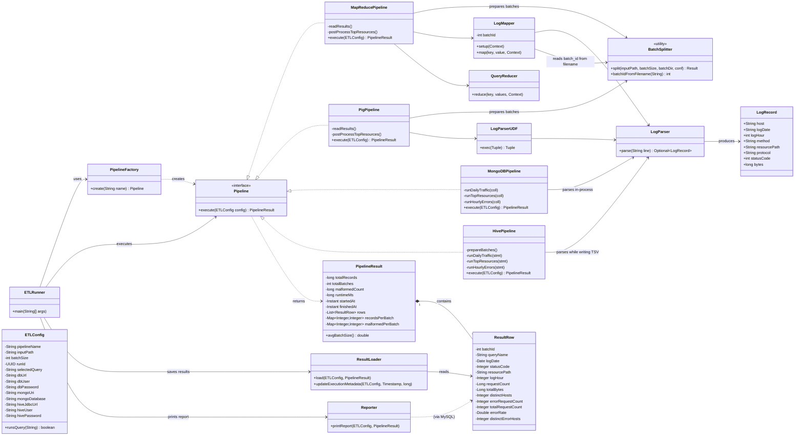
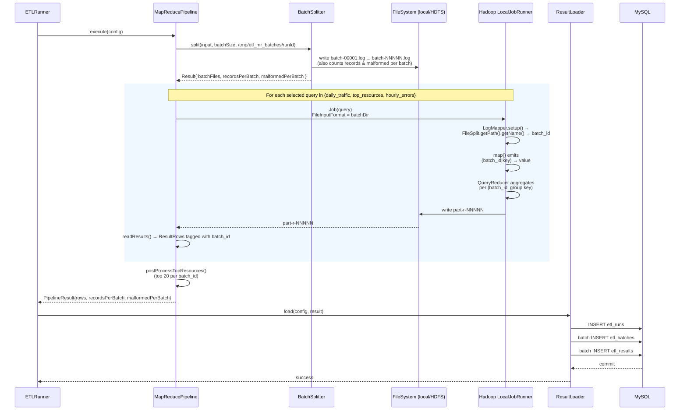
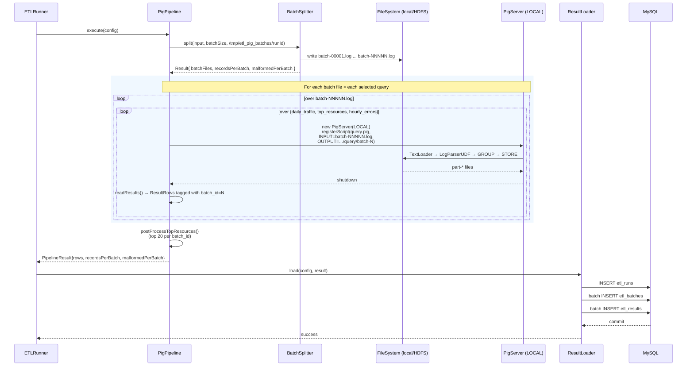
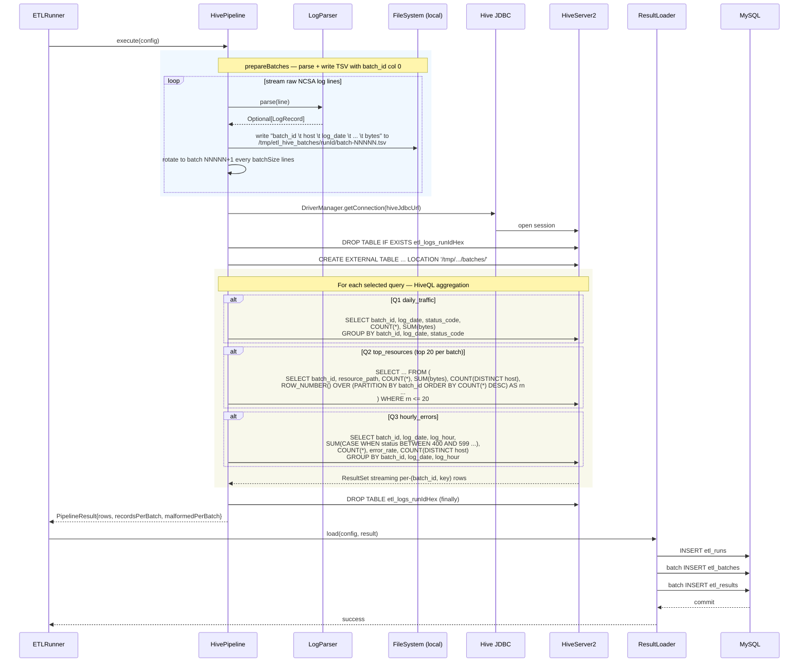
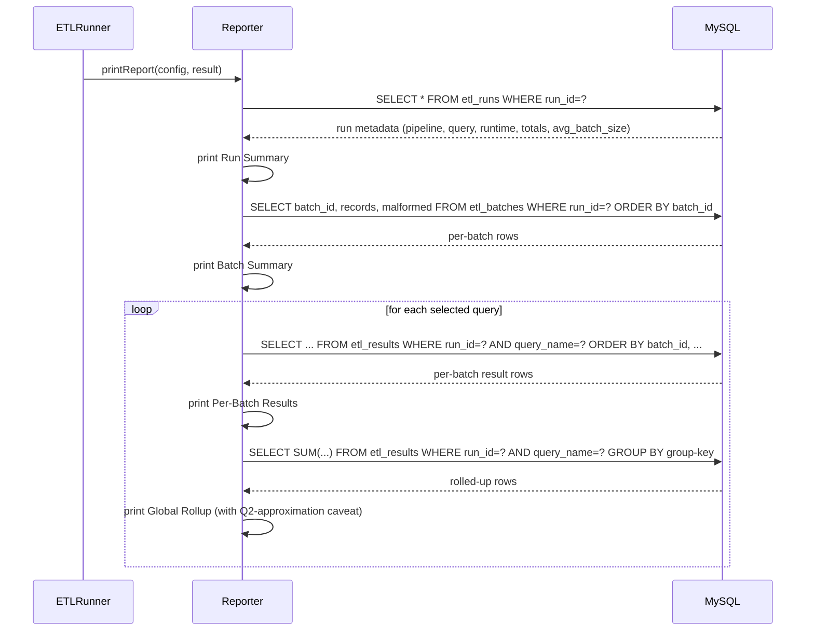

# NASA Log ETL Framework

A multi-pipeline ETL and reporting framework for NASA HTTP web server log analytics. The framework supports four pluggable execution backends — **MapReduce**, **Apache Pig**, **MongoDB**, and **Apache Hive** — that parse, aggregate, and store insights from raw web server logs into a relational MySQL database.

The user picks the execution backend, the query (`q1`, `q2`, `q3`, or `all`), and the batch size at the CLI. The ETL logic, parsing rules, batching logic, and reporting layer are identical across all four pipelines so the comparison is fair.

**Batching model.** Every pipeline produces *per-batch* aggregates: the raw input is split into batches of `batchSize` log lines, each batch is aggregated independently in the backend's own engine, and one result row is emitted per `(batch_id, group-by key)`. The reporter then computes a rolled-up global view in SQL on top of the per-batch rows.

---

## Architecture

The framework has three layers: a **controller layer** that owns the CLI, run ID, and lifecycle; an **execution layer** where four `Pipeline` implementations sit behind one interface; and an **output layer** where a shared `ResultLoader` and `Reporter` handle MySQL writes and console output identically for every pipeline.

### Class Architecture



### Execution Flow

```mermaid
flowchart TD

A[Start ETLRunner] --> B[Parse CLI args & build ETLConfig]
B --> C[Generate UUID run_id]
C --> D{Select Pipeline}

D -->|mapreduce| MR[MapReducePipeline]
D -->|pig|       PG[PigPipeline]
D -->|mongodb|   MG[MongoDBPipeline]
D -->|hive|      HV[HivePipeline]

%% --- batching layer ------------------------------------------------------
MR --> BS1[BatchSplitter.split → batch-NNNNN.log]
PG --> BS2[BatchSplitter.split → batch-NNNNN.log]
MG --> BS3[batched insertMany → docs tagged with batch_id]
HV --> BS4[prepareBatches → batch-NNNNN.tsv with batch_id col]

%% --- aggregation layer ---------------------------------------------------
BS1 --> EX1[MR job per query<br/>key prefixed with batch_id]
BS2 --> EX2[Pig script per batch × per query]
BS3 --> EX3[Mongo aggregation:<br/>group by batch_id, ...]
BS4 --> EX4[HiveQL:<br/>GROUP BY batch_id, ...]

%% --- collect ResultRows --------------------------------------------------
EX1 --> RR[List&lt;ResultRow&gt;<br/>each tagged with batch_id]
EX2 --> RR
EX3 --> RR
EX4 --> RR

%% --- query filter and top-20 per batch ------------------------------------
RR --> PP[Post-process:<br/>keep top 20 per batch for Q2<br/>filter to selected query]

%% --- load layer ----------------------------------------------------------
PP --> LD[ResultLoader:<br/>etl_runs + etl_batches + etl_results]

%% --- report layer --------------------------------------------------------
LD --> RP[Reporter reads MySQL:<br/>Run Summary → Batch Summary →<br/>Per-Batch Results → Global Rollup]

RP --> END[End]
```

### MapReduce Pipeline — Sequence



### Pig Pipeline — Sequence



### MongoDB Pipeline — Sequence

```mermaid
sequenceDiagram

participant Runner as ETLRunner
participant Mongo as MongoDBPipeline
participant LP as LogParser
participant DR as MongoDB driver
participant Coll as etl_logs_runIdHex
participant Loader as ResultLoader
participant DB as MySQL

Runner->>Mongo: execute(config)

Mongo->>DR: MongoClients.create(mongoUri)
Mongo->>Coll: drop() + createIndex(batch_id, log_date, status_code, ...)

rect rgb(240, 248, 255)
Note over Mongo,Coll: ETL — parse + batched insertMany

loop stream raw NCSA log lines
    Mongo->>LP: parse(line)
    LP-->>Mongo: Optional[LogRecord]
    Mongo->>Mongo: tag doc with current batch_id, append to buffer
    alt buffer.size() == batchSize
        Mongo->>Coll: insertMany(buffer)
        Coll-->>Mongo: ack
        Mongo->>Mongo: batchCount++ ; reset counters
    end
end
Mongo->>Coll: flush final partial buffer
end

rect rgb(248, 248, 235)
Note over Mongo,Coll: For each selected query — aggregation pipeline

alt Q1 daily_traffic
    Mongo->>Coll: aggregate([ $group _id:{batch_id,log_date,status_code}, $sort ])
end
alt Q2 top_resources (top 20 per batch)
    Mongo->>Coll: aggregate([ $group _id:{batch_id,resource_path},<br/>$project distinct_hosts:$size,<br/>$sort batch_id+count desc,<br/>$group _id:batch_id, top:$push,<br/>$project top:$slice 20 ])
end
alt Q3 hourly_errors
    Mongo->>Coll: aggregate([ $group _id:{batch_id,log_date,log_hour},<br/>error counts + $$REMOVE'd error_hosts,<br/>$project error_rate=$divide ])
end
Coll-->>Mongo: cursor over per-(batch_id, key) documents
end

Mongo->>Coll: drop()  (finally)

Mongo-->>Runner: PipelineResult{rows, recordsPerBatch, malformedPerBatch}

Runner->>Loader: load(config, result)
Loader->>DB: INSERT etl_runs
Loader->>DB: batch INSERT etl_batches
Loader->>DB: batch INSERT etl_results
DB-->>Loader: commit
Loader-->>Runner: success
```

### Hive Pipeline — Sequence



### Reporter — Sequence



---

## Dataset

| File | Period | Compressed | Uncompressed | Records |
|---|---|---|---|---|
| `NASA_access_log_Jul95` | Jul 01–31, 1995 | 20.7 MB | 205 MB | ~1,891,715 |
| `NASA_access_log_Aug95` | Aug 04–31, 1995 | 21.8 MB | 168 MB | ~1,569,898 |

**Log format** — each line is standard NCSA Combined Log:
```
199.72.81.55 - - [01/Jul/1995:00:00:01 -0400] "GET /history/apollo/ HTTP/1.0" 200 6245
```

**Important notes:**
- The August file covers **Aug 04–31 only**. The web server was shut down Aug 01 14:52:01 – Aug 03 04:36:13 due to Hurricane Erin. No records in this window is expected behaviour, not a parsing error.
- Download the files from the [Internet Traffic Archive](https://ita.ee.lbl.gov/html/contrib/NASA-HTTP.html). Decompression is the only allowed preprocessing.

---

## Prerequisites

- Java 8+
- Maven 3.6+
- Hadoop 3.3.6 (local mode works — no HDFS cluster required for development)
- MySQL 8+ with a database named `etldb`
- **MongoDB 5+** (only required for the MongoDB pipeline) — listening on `mongodb://localhost:27017` by default
- **HiveServer2** running and reachable at `jdbc:hive2://localhost:10000/default` (only required for the Hive pipeline)

---

## Build

```bash
mvn clean package
```

Produces `target/etl-framework-1.0.jar` (fat jar, all dependencies included).

---

## Setup

**1. MySQL — credentials and schema**

```bash
cp config/db.properties.example config/db.properties
# Edit config/db.properties with your MySQL host / user / password

mysql -u <user> -p -e "CREATE DATABASE IF NOT EXISTS etldb;"
mysql -u <user> -p etldb < sql/schema.sql
```

That creates `etl_runs`, `etl_batches`, and `etl_results` (drops them first if they already exist).

**2. Prepare input data**

```bash
gunzip NASA_access_log_Jul95.gz
gunzip NASA_access_log_Aug95.gz
mkdir -p nasa/logs && mv NASA_access_log_*95 nasa/logs/
```

For local mode the files can stay on the local filesystem. For cluster mode, upload to HDFS:

```bash
hdfs dfs -mkdir -p /nasa/logs
hdfs dfs -put NASA_access_log_Jul95 /nasa/logs/
hdfs dfs -put NASA_access_log_Aug95 /nasa/logs/
```

**3. (Optional) MongoDB — for the `mongodb` pipeline**

```bash
brew services start mongodb-community           # macOS
# or: sudo systemctl start mongod               # Linux

# Smoke-test:
mongosh --eval 'db.runCommand({ping:1})'
```

No collection setup is needed — `MongoDBPipeline` creates a per-run collection `etl_logs_runIdHex` inside the `etl_logs` database and drops it when the run finishes.

**4. (Optional) HiveServer2 — for the `hive` pipeline**

You need a running HiveServer2 reachable at `--hive-url` (default `jdbc:hive2://localhost:10000/default`):

```bash
# In a Hive 3.x install:
$HIVE_HOME/bin/schematool -dbType derby -initSchema   # one-time only
$HIVE_HOME/bin/hiveserver2 &

# Smoke-test (uses the standalone beeline that ships with Hive):
$HIVE_HOME/bin/beeline -u jdbc:hive2://localhost:10000/default -e 'SHOW DATABASES;'
```

`HivePipeline` creates an external table over the per-run batch directory under `/tmp/etl_hive_batches/<runId>/` and drops it when the run finishes — so HiveServer2 must be able to read that local path.

---

## Run

`scripts/run.sh` injects the JAR path and DB credentials from `config/db.properties` automatically, and uses `java -cp $(hadoop classpath)` under the hood (see [Launcher notes](#launcher-notes)). All examples below assume:

```bash
export INPUT=file://$PWD/nasa/logs/NASA_access_log_Jul95   # or a directory
export BATCH=50000
```

### CLI flags

| Flag | Required | Default | Description |
|---|---|---|---|
| `--pipeline` | yes | — | `mapreduce`, `pig`, `mongodb`, `hive` |
| `--input` | yes | — | Input path (`file:///` or `hdfs:///`); file or directory |
| `--batch-size` | no | 50000 | Records per batch |
| `--query` | no | `all` | `q1` / `q2` / `q3` / `daily_traffic` / `top_resources` / `hourly_errors` / `all` |
| `--db-url` | yes | — | MySQL JDBC connection URL |
| `--db-user` | yes | — | MySQL username |
| `--db-pass` | yes | — | MySQL password |
| `--mongo-uri` | no | `mongodb://localhost:27017` | MongoDB connection string |
| `--mongo-db` | no | `etl_logs` | MongoDB database for the per-run collection |
| `--hive-url` | no | `jdbc:hive2://localhost:10000/default` | HiveServer2 JDBC URL |
| `--hive-user` | no | empty | HiveServer2 username (if auth is enabled) |
| `--hive-pass` | no | empty | HiveServer2 password (if auth is enabled) |

If `--pipeline` is omitted in an interactive terminal, the CLI prompts for one of the four backends.

### Run every query × every pipeline

The 12 combinations from the evaluation spec (3 queries × 4 pipelines):

```bash
# --- MapReduce -----------------------------------------------------------
./scripts/run.sh --pipeline mapreduce --input "$INPUT" --batch-size "$BATCH" --query q1
./scripts/run.sh --pipeline mapreduce --input "$INPUT" --batch-size "$BATCH" --query q2
./scripts/run.sh --pipeline mapreduce --input "$INPUT" --batch-size "$BATCH" --query q3
./scripts/run.sh --pipeline mapreduce --input "$INPUT" --batch-size "$BATCH" --query all

# --- Pig -----------------------------------------------------------------
./scripts/run.sh --pipeline pig       --input "$INPUT" --batch-size "$BATCH" --query q1
./scripts/run.sh --pipeline pig       --input "$INPUT" --batch-size "$BATCH" --query q2
./scripts/run.sh --pipeline pig       --input "$INPUT" --batch-size "$BATCH" --query q3
./scripts/run.sh --pipeline pig       --input "$INPUT" --batch-size "$BATCH" --query all

# --- MongoDB (requires mongod on mongodb://localhost:27017) --------------
./scripts/run.sh --pipeline mongodb   --input "$INPUT" --batch-size "$BATCH" --query q1
./scripts/run.sh --pipeline mongodb   --input "$INPUT" --batch-size "$BATCH" --query q2
./scripts/run.sh --pipeline mongodb   --input "$INPUT" --batch-size "$BATCH" --query q3
./scripts/run.sh --pipeline mongodb   --input "$INPUT" --batch-size "$BATCH" --query all

# --- Hive (requires HiveServer2 on jdbc:hive2://localhost:10000/default) -
./scripts/run.sh --pipeline hive      --input "$INPUT" --batch-size "$BATCH" --query q1
./scripts/run.sh --pipeline hive      --input "$INPUT" --batch-size "$BATCH" --query q2
./scripts/run.sh --pipeline hive      --input "$INPUT" --batch-size "$BATCH" --query q3
./scripts/run.sh --pipeline hive      --input "$INPUT" --batch-size "$BATCH" --query all
```

Or to script the whole 12-combination matrix as one block:

```bash
for PIPE in mapreduce pig mongodb hive; do
  for Q in q1 q2 q3; do
    ./scripts/run.sh --pipeline "$PIPE" --input "$INPUT" --batch-size "$BATCH" --query "$Q"
  done
done
```

### Pointing at both NASA log files at once

Both `Jul95` and `Aug95` files in one directory → one run that scans them both:

```bash
./scripts/run.sh --pipeline mapreduce --input file://$PWD/nasa/logs --batch-size 100000 --query all
```

### Pointing at HDFS (cluster mode)

```bash
hdfs dfs -mkdir -p /nasa/logs
hdfs dfs -put NASA_access_log_Jul95 /nasa/logs/
hdfs dfs -put NASA_access_log_Aug95 /nasa/logs/

./scripts/run.sh --pipeline mapreduce --input hdfs:///nasa/logs/ --batch-size 100000 --query all
```

### Without `scripts/run.sh`

Use the raw `java -cp` form (the launcher just wraps this):

```bash
java -cp "target/etl-framework-1.0.jar:$(hadoop classpath)" com.etl.ETLRunner \
  --pipeline mapreduce \
  --input file:///path/to/NASA_access_log_Jul95 \
  --batch-size 50000 \
  --query all \
  --db-url  jdbc:mysql://localhost:3306/etldb \
  --db-user etl \
  --db-pass 'Etl@12345'
```

### Launcher notes

- The fat jar bundles `hive-jdbc`, whose META-INF entries cause `hadoop jar`'s unjar step to fail with `Mkdirs failed to create .../license`. The launcher uses `java -cp $(hadoop classpath)` instead, which sidesteps `hadoop jar` entirely while still resolving the local-mode `ClientProtocolProvider` from the system Hadoop install.
- A small `META-INF/services/org.apache.hadoop.mapreduce.protocol.ClientProtocolProvider` file is shipped inside the jar so `LocalJobRunner` is discoverable even when `hadoop-client` is `<scope>provided</scope>`.
- `hadoop` must be on `PATH` for the launcher to work.

---

## Queries

All three queries are implemented identically across every pipeline. With per-batch aggregation, the actual grouping is `(batch_id, <natural key>)` in every backend; the table below shows the **natural key** the query is conceptually grouped by.

| Query | Natural Group-By | Output Columns | Notes |
|---|---|---|---|
| Q1 Daily Traffic Summary | `log_date`, `status_code` | `request_count`, `total_bytes` | Plain SUM/COUNT per (date, status). |
| Q2 Top Requested Resources | `resource_path` | `request_count`, `total_bytes`, `distinct_host_count` | Top 20 *per batch* by `request_count`. |
| Q3 Hourly Error Analysis | `log_date`, `log_hour` | `error_request_count`, `total_request_count`, `error_rate`, `distinct_error_hosts` | Error = HTTP status in `[400, 599]`. |

### How each backend expresses Q1 (daily_traffic)

| Backend | Form |
|---|---|
| MapReduce | `LogMapper` emits `(batch_id\|log_date\|status_code, bytes)`; `QueryReducer` sums per key. |
| Pig | `pig/daily_traffic.pig`: `GROUP cleaned BY (log_date, status_code); FOREACH ... COUNT, SUM`. Run once per batch file. |
| MongoDB | `db.coll.aggregate([{$group:{_id:{batch_id,log_date,status_code}, request_count:{$sum:1}, total_bytes:{$sum:'$bytes'}}}, {$sort:{...}}])` |
| Hive | `SELECT batch_id, log_date, status_code, COUNT(*), SUM(bytes) FROM <table> GROUP BY batch_id, log_date, status_code` |

### How each backend expresses Q2 (top_resources, top 20 per batch)

| Backend | Form |
|---|---|
| MapReduce | `LogMapper` emits `(batch_id\|resource_path, host\|bytes)`; reducer counts; `postProcessTopResources()` sorts and takes top 20 per `batch_id` in Java. |
| Pig | `pig/top_resources.pig`: `GROUP cleaned BY resource_path; FOREACH ... COUNT, SUM, COUNT(DISTINCT hosts)`. Run once per batch file; top-20 selection in Java. |
| MongoDB | Aggregation: `$group` → `$project distinct_hosts:$size` → `$sort` → `$group _id:batch_id, top:$push` → `$project top:$slice 20`. |
| Hive | `SELECT ... FROM (SELECT ..., ROW_NUMBER() OVER (PARTITION BY batch_id ORDER BY COUNT(*) DESC) AS rn FROM <table> GROUP BY batch_id, resource_path) WHERE rn <= 20` |

### How each backend expresses Q3 (hourly_errors)

| Backend | Form |
|---|---|
| MapReduce | `LogMapper` emits `(batch_id\|log_date\|log_hour, status_code\|host)`; reducer counts errors / totals / distinct error hosts, computes `error_rate`. |
| Pig | `pig/hourly_errors.pig`: `GROUP BY (log_date, log_hour); FILTER errors BY status_code >= 400 AND <= 599`. Per batch file. |
| MongoDB | `$group` with `$sum: $cond[status BETWEEN 400 AND 599]`, `$addToSet` of host gated on the same condition, `$divide` for `error_rate`. |
| Hive | `SUM(CASE WHEN status_code BETWEEN 400 AND 599 THEN 1 ELSE 0 END)` + `COUNT(DISTINCT CASE WHEN ... THEN host END)`. |

---

## Database Schema

We use two tables in `etldb` to separate **execution metadata** from **query results**.

---

### **`etl_runs`** — one row per pipeline execution

Stores metadata about each ETL run.

| Column | Type | Description |
|---|---|---|
| `run_id` | VARCHAR(36) PK | UUID generated at startup |
| `pipeline` | VARCHAR(20) | Execution backend (mapreduce / pig / mongodb / hive) |
| `query_name` | VARCHAR(30) | Selected query: `daily_traffic` / `top_resources` / `hourly_errors` / `all` |
| `batch_size` | INT | Configured records per batch |
| `total_records` | BIGINT | Total records processed |
| `total_batches` | INT | Number of non-empty batches |
| `avg_batch_size` | DECIMAL(15,2) | `total_records / total_batches` |
| `malformed_count` | BIGINT | Records that failed parsing |
| `runtime_ms` | BIGINT | End-to-end runtime (read → compute → DB write) |
| `executed_at` | TIMESTAMP | Auto-generated timestamp of execution |

### **`etl_batches`** — one row per batch processed in a run

Captures per-batch metadata so the batching decisions are auditable.

| Column | Type | Description |
|---|---|---|
| `run_id` | VARCHAR(36) | FK to `etl_runs` |
| `batch_id` | INT | 1..N sequential batch identifier |
| `records_in_batch` | INT | Lines (records) belonging to this batch |
| `malformed_in_batch` | INT | Of those, lines that failed parsing |

---

### **`etl_results`** — query outputs (unified schema)

Stores results of all queries across all pipelines.

> One row represents a **(run × query × batch × group-by key)**. With per-batch aggregation, the same `log_date` / `resource_path` / `(log_date, log_hour)` can appear once per batch that contained it.

| Column | Type | Description |
|---|---|---|
| `id` | BIGINT PK | Auto-increment row identifier |
| `run_id` | VARCHAR(36) FK | Links to `etl_runs` |
| `pipeline` | VARCHAR(20) | Backend label — duplicated here for faster filtering |
| `batch_id` | INT | Which batch (1..N) this aggregate came from |
| `executed_at` | TIMESTAMP | Stamped at write time |
| `query_name` | VARCHAR(30) | `daily_traffic` / `top_resources` / `hourly_errors` |

#### Query-specific columns (sparse schema)

| Column | Used in | Description |
|---|---|---|
| `log_date` | Q1, Q3 | Date of request |
| `status_code` | Q1 | HTTP status code |
| `resource_path` | Q2 | Requested resource |
| `log_hour` | Q3 | Hour of request |
| `request_count` | Q1, Q2 | Total requests |
| `total_bytes` | Q1, Q2 | Total bytes transferred |
| `distinct_hosts` | Q2 | Unique hosts accessing resource |
| `error_request_count` | Q3 | Number of error requests |
| `total_request_count` | Q3 | Total requests in that hour |
| `error_rate` | Q3 | error_request_count / total_request_count |
| `distinct_error_hosts` | Q3 | Unique hosts causing errors |

> Columns not relevant to a query remain **NULL**.

---

### Design Rationale

- **Separation of concerns** — `etl_runs` holds *execution* metadata, `etl_batches` holds per-batch *batching* metadata, and `etl_results` holds *analytical* outputs. Each table answers exactly one question.
- **Unified results table** — A single `etl_results` table is used for all three queries with `query_name` as a discriminator. Columns irrelevant to a given query are `NULL` (sparse schema). New queries can be added without schema changes.
- **Real `batch_id`** — Every result row carries the `batch_id` of the batch it was computed from. Together with the `etl_batches` table this makes batching auditable: `SUM(records_in_batch) = total_records`, `COUNT(DISTINCT batch_id) = total_batches`.
- **Cheap rollups in SQL** — The reporter computes the global view by running `SUM(...) GROUP BY <group-key>` over `etl_results` filtered by `(run_id, query_name)` — no extra pipeline plumbing needed.
- **Query simplicity** — Most reporting queries fit the same template:
  ```sql
  SELECT * FROM etl_results WHERE run_id = ? AND query_name = ? ORDER BY batch_id, ...
  ```

See [`sql/schema.sql`](sql/schema.sql) for the full DDL and [`sql/sample_queries.sql`](sql/sample_queries.sql) for reporting queries.

## Project Structure

```
etl-framework/
├── config/
│   └── db.properties.example
├── pig/                                # Pig Latin scripts (one per query)
│   ├── daily_traffic.pig
│   ├── top_resources.pig
│   └── hourly_errors.pig
├── sql/
│   ├── schema.sql                      # etl_runs / etl_batches / etl_results DDL
│   └── sample_queries.sql              # reporting queries
├── scripts/
│   ├── run.sh                          # launcher (java -cp + hadoop classpath)
│   └── setup_hdfs.sh                   # optional HDFS upload helper
├── pom.xml
└── src/main/
    ├── java/com/etl/
    │   ├── ETLRunner.java              # CLI parser + lifecycle
    │   ├── PipelineFactory.java        # name → Pipeline implementation
    │   ├── core/
    │   │   ├── BatchSplitter.java      # raw NCSA → batch-NNNNN.log files
    │   │   ├── ETLConfig.java          # immutable run config
    │   │   ├── LogParser.java          # NCSA Combined Log regex parser
    │   │   ├── LogRecord.java          # parsed record DTO
    │   │   ├── Pipeline.java           # backend interface
    │   │   ├── PipelineResult.java     # rows + per-batch metadata
    │   │   └── ResultRow.java          # one (run × query × batch × key) row
    │   ├── db/
    │   │   └── ResultLoader.java       # writes etl_runs / etl_batches / etl_results
    │   ├── pipeline/
    │   │   ├── mapreduce/
    │   │   │   ├── MapReducePipeline.java
    │   │   │   ├── LogMapper.java      # batch_id from FileSplit filename
    │   │   │   └── QueryReducer.java
    │   │   ├── pig/
    │   │   │   ├── PigPipeline.java    # per-batch script invocations
    │   │   │   └── LogParserUDF.java   # bridges Pig → LogParser
    │   │   ├── mongodb/
    │   │   │   └── MongoDBPipeline.java
    │   │   └── hive/
    │   │       └── HivePipeline.java
    │   └── report/
    │       └── Reporter.java           # Run + Batch + Per-Batch + Rollup
    └── resources/
        └── META-INF/services/
            └── org.apache.hadoop.mapreduce.protocol.ClientProtocolProvider
```

---

## Pipeline Equivalence

All four pipelines implement the same logical ETL steps, do **per-batch** aggregation, and produce the same result schema:

| Stage | MapReduce | Pig | MongoDB | Hive |
|---|---|---|---|---|
| Raw input | NCSA log lines (local FS / HDFS) | NCSA log lines | NCSA log lines | NCSA log lines |
| Batch splitter | `BatchSplitter` writes raw `batch-NNNNN.log` files | `BatchSplitter` writes raw `batch-NNNNN.log` files | In-memory `insertMany` chunks of `batchSize` docs, tagged with `batch_id` | Java `prepareBatches` writes parsed TSV with `batch_id` as col 1 |
| Parsing | `LogMapper` (inside MR) calls `LogParser`; `batch_id` recovered from `FileSplit` filename | Per-batch invocations of `pig/*.pig`; `LogParserUDF` parses inside Pig | Java `LogParser` before insert | Java `LogParser` while writing TSV |
| Aggregation grain | `GROUP BY batch_id, …` via prefixed reducer key | One Pig run per batch → per-batch results stamped in Java | `$group _id: {batch_id, …}` | `GROUP BY batch_id, …` in HiveQL |
| Top-20 limit | Top 20 per batch in Java | Top 20 per batch in Java | `$sort` + `$group $push` + `$slice 20` | `ROW_NUMBER() OVER (PARTITION BY batch_id ORDER BY count DESC)` |
| Result load | Shared `ResultLoader` → MySQL | Shared `ResultLoader` → MySQL | Shared `ResultLoader` → MySQL | Shared `ResultLoader` → MySQL |
| Reporting | Shared `Reporter`: per-batch + SQL global rollup | same | same | same |

The CLI, `LogParser`, `ResultRow` schema, `ResultLoader`, and `Reporter` are reused unchanged across every pipeline.

## Batching Strategy

- The raw NASA log is **split into batches of exactly `--batch-size` input lines**. Both successfully-parsed and malformed lines count toward a batch's size, so the batch boundaries are deterministic and reproducible.
- Each batch gets a sequential `batch_id` starting at 1. The final batch may contain fewer than `batch-size` records — it is still counted as one valid batch.
- For MR and Pig, the splitter writes `batch-NNNNN.log` files under `/tmp/etl_{mr,pig}_batches/<runId>/`. Each pipeline recovers `batch_id` from the filename so the aggregation engine itself sees the batch tag.
- For Hive, the splitter writes `batch-NNNNN.tsv` files where `batch_id` is the first column; the external table has a typed `batch_id INT` column.
- For MongoDB, each parsed record is tagged with `batch_id` in-memory before `insertMany`, and every aggregation `$group`s on `batch_id` first.
- `total_batches` and `avg_batch_size = total_records / total_batches` are persisted to `etl_runs`; per-batch `(records_in_batch, malformed_in_batch)` are persisted to `etl_batches`.

## Sample Output

What the reporter prints for a small `mapreduce / q1 / batch_size=1500` run over the first 5000 lines of `NASA_access_log_Jul95`:

```
=================================================
ETL Run Report
=================================================
Pipeline           : mapreduce
Query              : daily_traffic
Run ID             : 773607c0-f7a9-4c01-84ec-fa233501fe07
Executed At        : 2026-05-13 20:52:55 IST
Runtime            : 2457 ms (2.46 s)
Batch Size         : 1500
Total Records      : 5000
Malformed Records  : 0
Total Batches      : 4
Average Batch Size : 1250.00
=================================================

Batch Summary
-------------------------------------------------
BatchId  Records  Malformed
1        1500     0
2        1500     0
3        1500     0
4        500      0

Per-Batch Results: daily_traffic
-------------------------------------------------
BatchId  LogDate     StatusCode  RequestCount  TotalBytes
1        1995-07-01  200         1327          30449608
1        1995-07-01  302         68            5100
1        1995-07-01  304         95            0
1        1995-07-01  404         10            0
2        1995-07-01  200         1338          34116835
...

Global Rollup: daily_traffic
-------------------------------------------------
LogDate     StatusCode  RequestCount  TotalBytes
1995-07-01  200         4470          116989718
1995-07-01  302         240           20403
1995-07-01  304         263           0
1995-07-01  404         27            0
```

And in MySQL:

```sql
SELECT pipeline, query_name, total_records, total_batches, avg_batch_size, runtime_ms
FROM etl_runs ORDER BY executed_at DESC LIMIT 1;
+-----------+---------------+---------------+---------------+----------------+------------+
| pipeline  | query_name    | total_records | total_batches | avg_batch_size | runtime_ms |
+-----------+---------------+---------------+---------------+----------------+------------+
| mapreduce | daily_traffic |          5000 |             4 |        1250.00 |       2457 |
+-----------+---------------+---------------+---------------+----------------+------------+

SELECT * FROM etl_batches WHERE run_id = '773607c0-...';
+--------+------------------+--------------------+
| batch_id | records_in_batch | malformed_in_batch |
+--------+------------------+--------------------+
|      1 |             1500 |                  0 |
|      2 |             1500 |                  0 |
|      3 |             1500 |                  0 |
|      4 |              500 |                  0 |
+--------+------------------+--------------------+
```

## Known Limitations

- **Top-20 global rollup is approximate** — only per-batch top-20s are SUM-ed across batches. A resource that ranks 21st in every batch would be missed. The reporter prints this caveat next to the Q2 rollup table.
- **Hive pipeline** requires HiveServer2 to be running. The fat-jar bundles `hive-jdbc:3.1.3` so no client-side install of Hive is needed beyond the running server.
- **MongoDB pipeline** uses one temporary collection per run (`etl_logs_<runId-hex>` inside the `etl_logs` database) and drops it on completion.
- **Launcher uses `java -cp $(hadoop classpath)`, not `hadoop jar`.** The fat jar bundles `hive-jdbc`, whose META-INF entries make `hadoop jar`'s unjar step fail. `scripts/run.sh` builds the right classpath automatically — just make sure `hadoop` is on `PATH`.